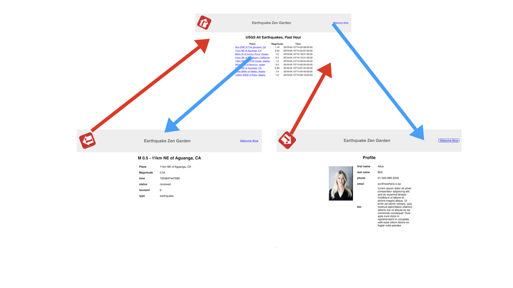
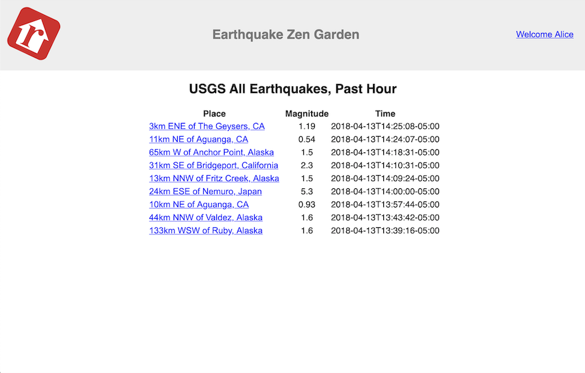
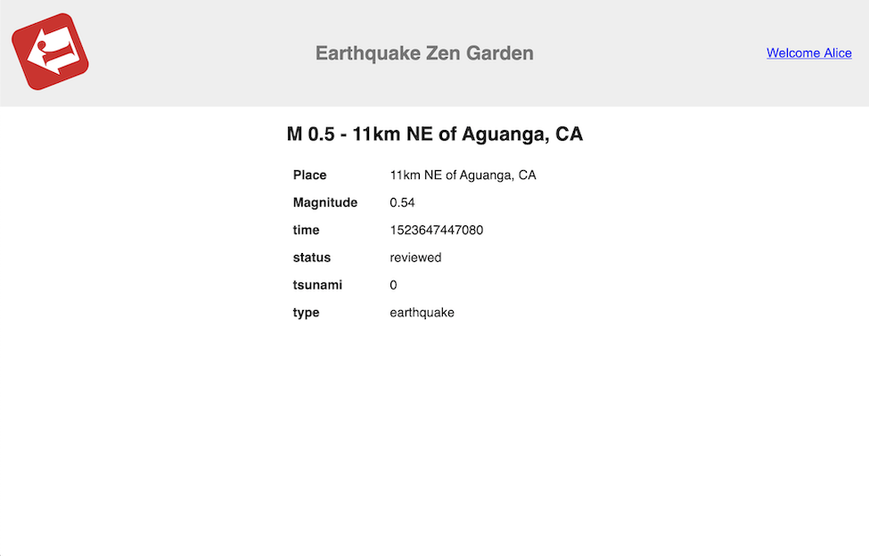
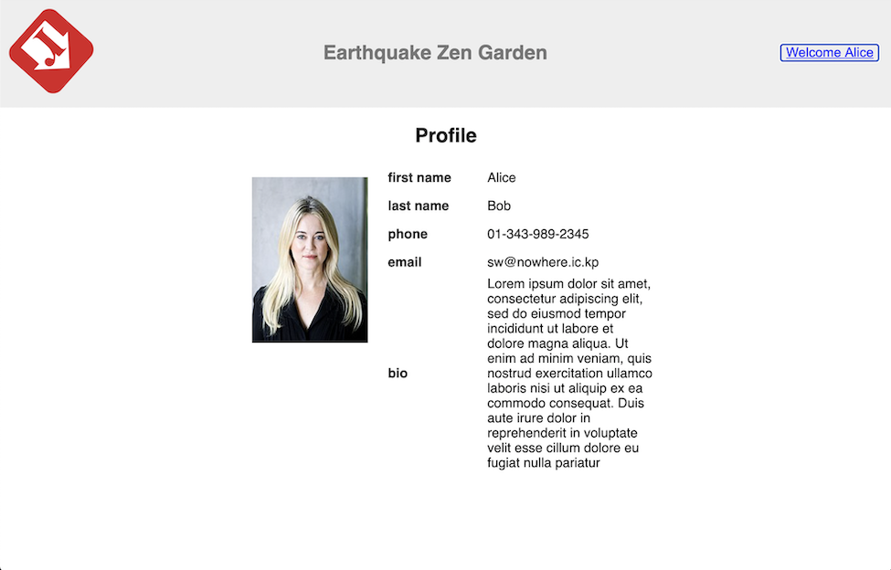

**Earthquake Zen Garden**

**Steps:**
- Clone the repo
- Create a new branch
- Build all the requested features on the new branch
- Either commit the local branch or zip the code and send it to interviewer

---------------------------------------------------------------------------------------------------------------------------------

This is a simple app that shows a homepage with a list of earthquakes. It has a header with a logo (link back to home), and a link to a profile detail view. Each entry in the table links to a detail view of that particular record. See the screens and reference data below.

**Page navigation**

- **Instructions:**
    - Create an app called ‘earthquake-zen-garden’ (suggest Create React App )
    - Use the provided data.js JSON file to create the app according to the diagram above
    - If possible create a Github repo to host the app 
    - The app should have 3 main views:
    - Home
    - Detail
    - Profile

There should be no errors or warnings in the console (eg missing key in the loop )
The expectation is to be able to:

**Screens References**

